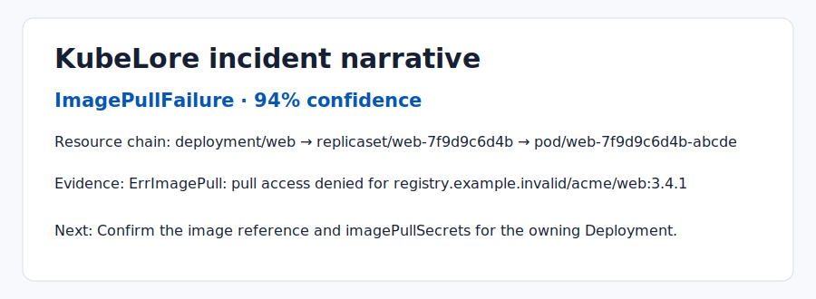

# KubeLore

[](https://github.com/KanadeK/kubelore/actions/workflows/ci.yml)
[](LICENSE)

**Turn Kubernetes evidence into a readable, offline fault chain—not another generic dashboard.**



- Traces Deployment → ReplicaSet → Pod → Container relationships from a portable bundle.
- Explains five common incident classes with evidence, confidence, and focused next steps.
- Runs entirely offline and read-only; it neither needs nor changes cluster credentials.

```bash
python -m pip install -e '.[dev]'
kubelore analyze examples/bundles/image-not-found.json
```

Example output:

```text
Primary chain: ImagePullFailure (94%)
Evidence: pod/web-7f9d9c6d4b-abcde event Failed: pull access denied for registry.example.invalid/acme/web:3.4.1
Next step: Confirm the image reference and imagePullSecrets for deployment/web.
```

KubeLore is currently **v0.1.0**. It consumes exported incident data, not a live
cluster. See [privacy and security](docs/PRIVACY_AND_SECURITY.md) before sharing a bundle.

## Features

- Import the repository's JSON offline bundles or a `kubectl cluster-info dump` JSON export.
- Build an inspectable resource graph and an ordered incident timeline.
- Detect image pull failures, probe failures, OOM kills, missing configuration, and unschedulable pods.
- Render reports in terminal, JSON, or a self-contained HTML page.

## Non-goals

KubeLore is not a live monitoring dashboard, an LLM diagnosis service, or a cluster
remediation tool. Its default and only MVP mode is read-only analysis.

## Architecture

The domain layer is pure and testable. File parsing lives in adapters; orchestration
lives in services; FastAPI only presents report data. See [architecture](docs/ARCHITECTURE.md).

## Installation and quick start

Use Python 3.12 or newer:

```bash
python -m pip install -e '.[dev]'
make demo
uvicorn kubelore.api:app --reload
```

Open `http://127.0.0.1:8000/` and select a bundled incident. For CLI and API details,
run `kubelore --help` and see the JSON output from `kubelore analyze --help`.

## Sample data

Five synthetic, MIT-licensed bundles are in `examples/bundles/`: image not found,
probe failure, OOM, missing configuration, and failed scheduling. They contain no
credentials or customer data and are deterministic fixtures for the tests.

## Testing and release checks

```bash
make verify
make demo
make package
make release-check
```

`make verify` runs linting, strict type checking, coverage-gated tests, and a Python build.
`make package` produces wheel, source distribution, report bundle, and SHA256 checksums.

## Privacy and security

Reports redact common secret-shaped fields before rendering. Review imported data
before sharing it, and treat the report as incident evidence rather than a remedy.

## Differentiation

An April 2026 sample of public repositories found no active project with the same
name and a highly identical offline, deterministic evidence-chain MVP. KubeLore
deliberately avoids online LLM dependencies and automatic remediation. Details:
[competitor scan](docs/COMPETITOR_SCAN.md).

## Roadmap

v0.2.0 may add more export formats and configurable redaction; v0.1.0 focuses on
offline incident narratives with transparent rules.

## FAQ

**Does KubeLore connect to my cluster?** No. The MVP reads a local file only.

**Can it fix a deployment?** No. It produces suggested investigation steps only.

## Contributing

Read [CONTRIBUTING.md](CONTRIBUTING.md), then submit a focused pull request with tests.

中文说明见 [README.zh-CN.md](README.zh-CN.md).

